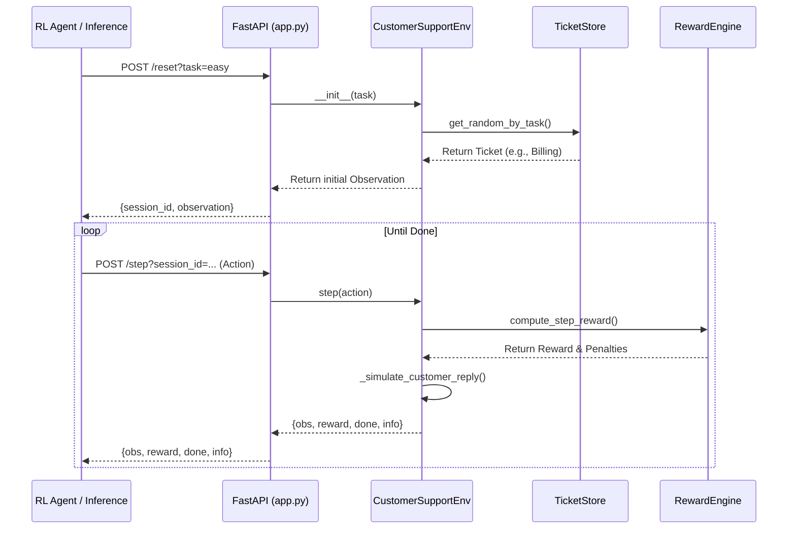
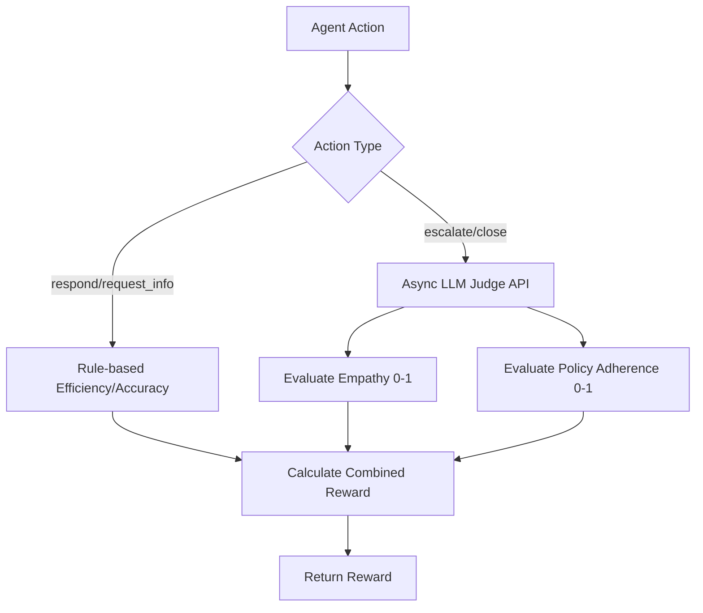

# Project Documentation & Round 2 Upgrade Guide  
**Customer Support RL Environment – OpenEnv Environment**

## 1. Project Overview
**Domain & Core Purpose:**
The Customer Support Environment is a Reinforcement Learning (RL) environment compliant with the OpenEnv standard. It simulates an AI customer support agent handling a variety of incoming tickets across varying difficulties (easy to nightmare). 

**Real-world Problem Solved:**
Tier-1 enterprise companies often face enormous costs and SLA (Service Level Agreement) breach penalties due to poor customer service triaging. Current LLMs acting as support agents often attempt to self-resolve critical outages (wasting time) or fail to accurately follow policy when frustrated customers interact with them. This environment trains agents to correctly triage, escalate when necessary, and resolve issues efficiently without falling into "keyword-stuffing" traps.

**High-Level Features:**
- **Task Difficulties:** Easy, Medium, Hard, and Nightmare, simulating different SLA and technical complexities.
- **Counter-Intuitive Hard Task:** Penalizes agents for trying to solve a problem that strictly requires an immediate human escalation.
- **Shaped Rewards:** Multi-dimensional rewards evaluating resolution, tone, efficiency, and accuracy.
- **Stateless Server Architecture:** UUID-based session isolation with an overarching FastAPI HTTP layer.

---

## 2. Alignment with Hackathon Themes
**Current Alignment:**
The environment currently maps to the **Professional & Personalized Tasks** theme and loosely fits **World Modeling**, as it simulates a continuous interaction with a persona-driven user.

**Recommended Target Theme for Round 2:**
**Theme: Multi-Agent Interactions & Professional Tasks (Indian Enterprise Context)**
*Justification:* The Indian enterprise ecosystem (e.g., UPI payments, hyper-local logistics) offers incredibly complex, high-stakes support scenarios. Shifting the environment to explicitly train an Indian Tier-1 Support Agent navigating UPI failures or festive season (Big Billion Days) SLA breaches will greatly increase the innovation factor.

**Potential Sub-Themes / Sponsor Angles:**
- **Scale AI / Patronus AI:** Perfect for benchmarking frontier models on policy adherence vs. hallucination (e.g., promising a refund when the policy strictly forbids it).
- **Fleet AI / Halluminate:** Training the model to recognize missing tools or API failures (simulated) and effectively communicate the state to the customer without hallucinating internal processes.

**Suggested Novel Angle (USP to maximize 40% Innovation Score):**
- **Dynamic Hinglish / Multilingual Customer Simulator:** Implement a lightweight LLM (acting as the customer) that switches from polite English to frustrated "Hinglish" (Hindi + English) when the agent's tone score drops. 

---

## 3. Architecture & System Design

**Overall OpenEnv Architecture:**
The environment follows a standard Client-Server separation where the actual environment state lives inside the server memory, isolated by session IDs.

- **Typed Models (`models.py`):** Uses Pydantic to strictly define `Action`, `Observation`, `Reward`, and `Ticket`. Uses Python Enums for `ActionType`.
- **Server Environment (`env/environment.py`):** The core OpenEnv instance `CustomerSupportEnv`. Manages episode lifecycle (`reset`, `step`), simulates customer replies, updates sentiment, and logs the history.
- **FastAPI App (`server/app.py`):** The HTTP interface. Hardened with `slowapi` rate limiting, a max concurrent session cap (500), body size limits (64KB), and an automated session TTL garbage collector.
- **Config (`openenv.yaml`):** Standard definition file describing the action space, observation space, tasks, and API endpoints.

**Architecture & Request Flow Diagram:**

---

## 4. Domain Features & Environment Details

**Action Space (Discrete but parameterized):**
- `respond`: Agent sends a message (`message` required).
- `request_info`: Agent requests specific details from the customer (`message` required).
- `escalate`: Agent escalates the ticket to a human (`reason` required).
- `close`: Agent resolves the ticket (`message` required).

**Observation Space:**
Includes `session_id`, `ticket_id`, `category`, `priority`, `subject`, `conversation_history` (list of messages), `customer_sentiment` ([-1.0, 1.0]), `mood_trajectory` (last 3 sentiments), `unresolved_issues`, `step`, `max_steps`, `is_done`, and `task`.

**Internal State & Dynamics:**
The environment maintains a hidden `_ticket` object which defines the `expected_resolution_type` and `required_info_before_close`. Customer sentiment is an internal float that decays or improves based on the agent's tone and actions. A simulated customer responds to the agent at the end of each step based on hardcoded personas (`impatient`, `polite`, `confused`).

---

## 5. Reward System Analysis

**Current Implementation:**
The reward is dense and shaped. At each step, a raw score is calculated using:
- **Tone (20%):** VADER SentimentIntensityAnalyzer.
- **Efficiency (20%):** `1.0 - (steps_used / max_steps)`.
- **Accuracy (20%):** Regex-based matching of required information.
- **Resolution (40%):** On terminal steps, checks for keyword matches from `_RESOLUTION_SIGNALS`.
- **Penalties:** Loop penalty (TF-IDF cosine similarity), contradiction penalty, and bad-escalation penalty.

**Strengths & Weaknesses:**
- *Strength:* Dense rewards prevent sparse reward collapse during training.
- *Weakness:* VADER and regex are highly gamable. An agent can say "I love you so much, refund refund refund" and score highly on Tone and Resolution despite providing terrible support.

**Suggestions for Round 2 Upgrade (Hybrid Dense Reward):**
Introduce **LLM-as-a-Judge**. Keep the efficiency and accuracy (regex) components rule-based for speed, but use an async call to a fast LLM (e.g., Llama-3 8B) to grade the `Tone` (Empathy) and `Resolution` (Policy Adherence).

---

## 6. Flow & Interaction

1. **Reset:** The client calls `/reset?task={difficulty}`. The server instantiates a `CustomerSupportEnv`, pulls a random ticket from `TicketStore`, and returns an initial observation.
2. **Step:** The client LLM processes the observation and selects an `Action`. The client calls `/step`.
3. **Simulation:** The environment logs the agent's message, computes the step reward, updates the customer sentiment, and simulates a customer reply.
4. **Termination:** If the agent uses the `close` or `escalate` action, or if `step >= max_steps`, `is_done` becomes True. A final Grader evaluates the overall session for the leaderboard.

---

## 7. Current Strengths & Weaknesses

**What works well:**
- Strong, modular codebase with production-grade FastAPI hardening.
- PII sanitization built-in.
- Clear separation of concerns (Environment, Models, Server, Reward).

**Gaps vs. Round 2 Judging Criteria:**
- **Innovation:** Hardcoded customer replies (`_FOLLOW_UPS`) lack the dynamic nature of a true world model.
- **Training Pipeline:** Missing a standard RLHF/GRPO training script (`train.py`) and a training notebook.
- **Improvement Proof:** Missing validation graphs (matplotlib) showing a baseline model vs. the fine-tuned model's reward over time.
- **UI:** No visual interface (Gradio/Streamlit) for judges to interact with the environment on Hugging Face Spaces.

---

## 8. Round 2 Improvement Roadmap

**1. Training Pipeline & Plots (High Priority - 30% of Score)**
- **Action:** Create `train_grpo.py` using Unsloth and Hugging Face TRL (`GRPOTrainer`).
- **Goal:** Train a small model (`unsloth/Meta-Llama-3-8B-Instruct`) to stop self-resolving the `hard` task and immediately escalate.
- **Deliverable:** Generate a `baseline_vs_trained.png` line chart showing reward improvements.

**2. Dynamic LLM Customer Simulator (Innovation - 40% of Score)**
- **Action:** Rip out the static `_FOLLOW_UPS` dict in `environment.py`.
- **Goal:** Use a fast LLM prompt: *"You are an impatient customer. The agent just said {X}. Your frustration level is {Y}. Reply in 1-2 sentences."* Add a 10% chance of the customer speaking Hinglish to boost the Indian Enterprise novelty factor.

**3. LLM-as-a-Judge Reward System**
- **Action:** Update `reward_engine.py` to use an LLM for evaluating `Tone` and `Resolution Quality` against a strict rubric.

**4. Storytelling & UI (Storytelling - 30% of Score)**
- **Action:** Build `app_ui.py` using Gradio to visualize the conversation and a real-time reward breakdown chart.

---

## 9. Deliverables for Winning Submission

- [ ] **Fully Functional HF Space:** Running the FastAPI server AND a Gradio frontend.
- [ ] **`train_grpo.py`:** The Unsloth/TRL training script.
- [ ] **`training_walkthrough.ipynb`:** A Jupyter Notebook showing how the training was conducted.
- [ ] **Results Graphs:** Visual proof that the model learned the environment (Reward vs. Epochs).
- [ ] **3-Minute Demo Video:** Explain the Indian Enterprise context, show the Gradio UI, and highlight the training graphs.
- [ ] **README.md:** Updated with the new narrative and setup instructions.

---

## 10. Appendices

### A. Suggested Mermaid Flow for LLM-as-a-Judge

### B. Suggested Environment State Upgrade for "Schema Drift"
Introduce an `environment_event` into the observation space. Mid-conversation, trigger an event like: *"System Outage: Payment gateway is down. Do not process refunds."* The agent must dynamically adapt its policy based on the changing environment, greatly boosting the RL complexity score.
