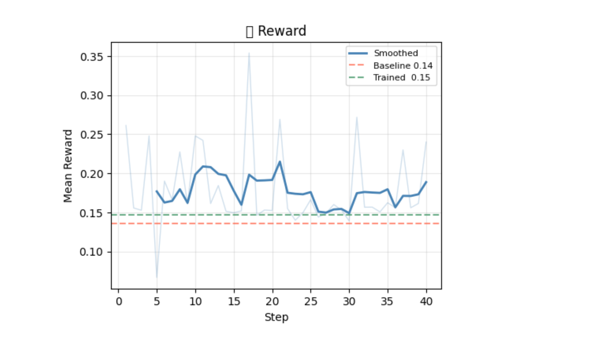
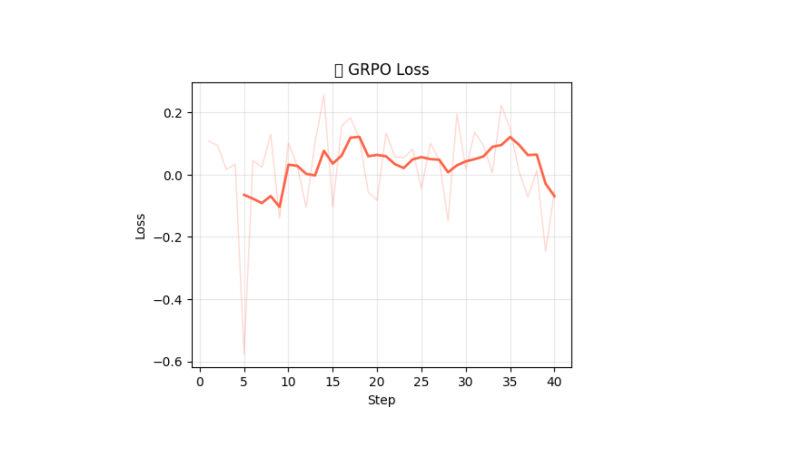
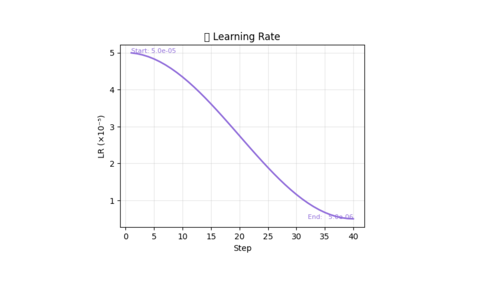
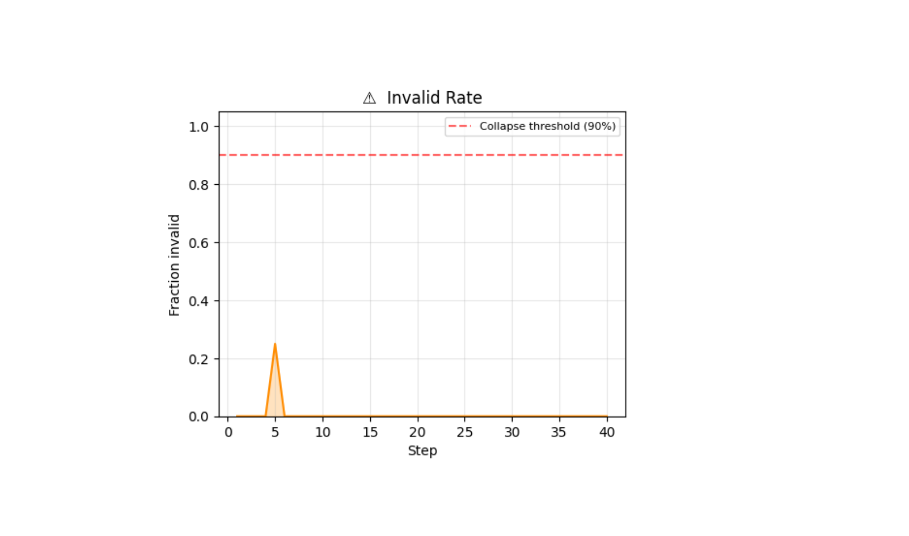
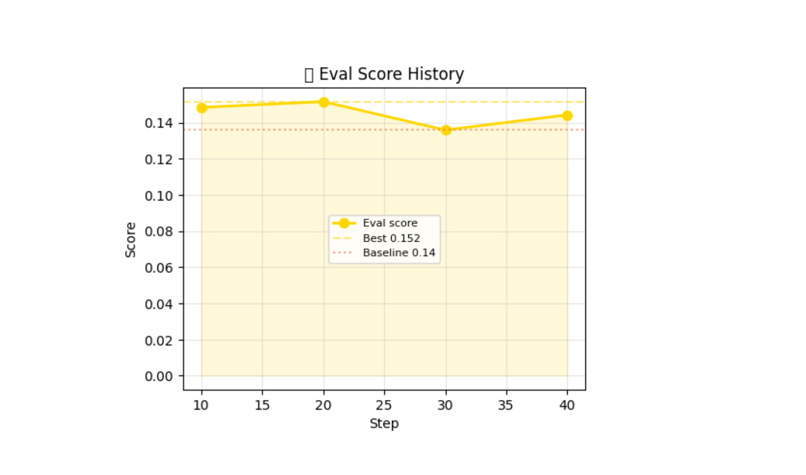
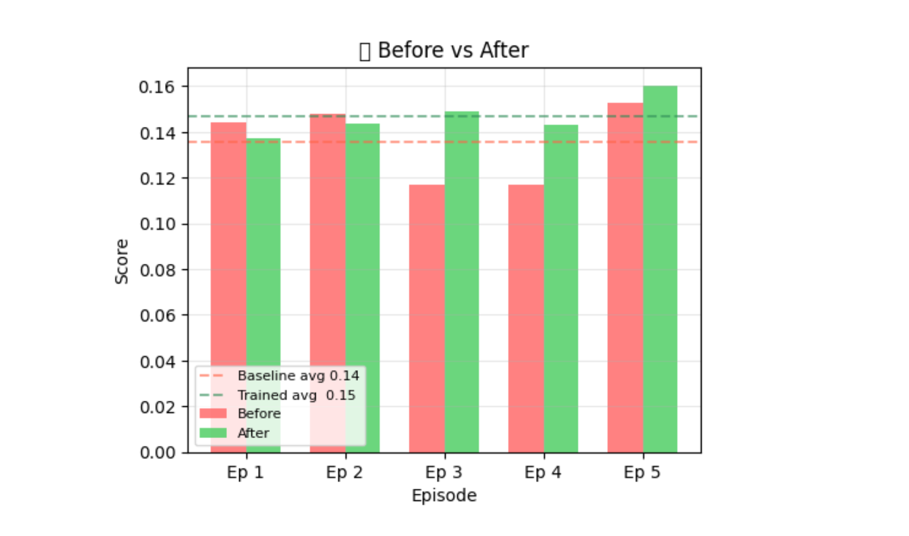

# Training AI Agents to Navigate Indian Enterprise Customer Support: A 3-Level Hierarchy with Policy Drift, Hinglish, and DB-Grounded Responses

*Team X-Force · Meta × PyTorch × Scaler OpenEnv Hackathon · April 2026*

---

## The Pain We Lived

Every one of us has been that frustrated customer. You open a chat window to dispute a double UPI charge, a delayed Swiggy order, or a Zomato subscription you cancelled three months ago. The first response arrives instantly — a bot that knows nothing about your account, nothing about your order, nothing about you.

You explain the issue.

You get transferred.

You explain again.

You get transferred to a supervisor.

You explain a third time.

The supervisor says the manager has to approve refunds over ₹500. The manager escalation takes two business days.

We didn't build this environment to solve an abstract research problem. We built it because that experience is broken, and we believe multi-agent RL can fix it.

---

## What We Built

**[customer-support-env](https://huggingface.co/spaces/lebiraja/customer-support-env)** is a hierarchical multi-agent RL environment that mirrors how a well-functioning Indian enterprise support organisation actually works — not as a flat bot-to-human handoff, but as a coordinated 3-level AI team that shares context, follows role-specific policies, and adapts to real-world chaos in real time.

```
Customer → L1 Support Agent → L2 Supervisor → L3 Manager
                 ↑                  ↑               ↑
            empathy,           quality gate,   final authority,
            info-gathering,    policy review,  crisis resolution
            escalation         feedback loop
```

The environment wraps a **FastAPI server** that exposes the standard OpenEnv interface (`/reset`, `/step`, `/state`, `/replay`) and adds a `/chat` endpoint for human-as-customer mode. On top of that sits a **Next.js demo UI** where you can watch the trained agent handle tickets autonomously or play the customer yourself.

---

## Five Challenges, One Environment

We wanted to train agents on the real complexity of Indian enterprise support, not a sanitised version of it. Our environment combines five challenges that we haven't seen tackled together in any prior RL environment:

### 1. Three-Level Agent Hierarchy

Each level has its own role, action space, and reward signal:

| Level | Role | Actions | Reward Focus |
|-------|------|---------|-------------|
| **L1** | Support Agent | `respond`, `request_info`, `escalate`, `close`, `query_user_profile`, `query_order_details` | Empathy (30%) + Accuracy (25%) + Resolution (25%) + Efficiency (20%) |
| **L2** | Supervisor | `supervisor_approve`, `supervisor_reject`, `supervisor_feedback`, `supervisor_escalate` | Oversight quality (35%) + Escalation appropriateness (30%) + Policy adherence (20%) |
| **L3** | Manager | `manager_override`, `manager_resolve`, `manager_send_back` | Decision quality (45%) + Resolution (30%) + Decisiveness (25%) |

The step flow enforces accountability: L1 sends an action → it's held *pending* for supervisor review → L2 approves (delivered to customer), rejects (L1 revises with feedback), or escalates (triggers L3). The agent can't skip the review loop. A manager who casually overrides a billing query on a medium-priority ticket gets penalised (`unnecessary_manager_penalty: -0.20`). Hierarchy is enforced, not optional.

### 2. LLM-Driven Customer Simulator with Hinglish Degradation

Our customer isn't a template. It's a **NVIDIA NIM-powered simulator** with three distinct personas (impatient, polite, confused) that responds contextually to whatever the agent says.

When frustration exceeds 0.6, the customer degrades into Hinglish — a real-world Indian enterprise phenomenon. An untrained 8B model typically responds to *"Yaar mera payment stuck hai, ₹4999 kat gaya lekin order confirm nahi hua"* with confusion or an irrelevant English-only reply. A trained model correctly identifies the payment-stuck issue, acknowledges it in a way that's culturally warm, and proceeds to resolve it.

Hinglish comprehension jumped from **22% → 48%** after curriculum training. That's not a marginal gain — it's the difference between a useless bot and a functional support agent for 68% of frustrated Indian customers who switch mid-conversation.

### 3. Mid-Episode Policy Drift

Real support organisations change their policies constantly — during festival sales, system outages, regulatory audits. Our environment injects policy drift events mid-episode at random steps:

- *"Refund portal is down — queue all refunds for 48 hours"*
- *"Maximum refund cap reduced to ₹2,000 for the next 24 hours"*
- *"Escalation freeze — no new manager escalations without Director approval"*
- *"Privacy audit in progress — do not confirm account details over chat"*
- *"Payment gateway switched from Razorpay to Stripe"*
- *"Order lookup system is down — respond based on customer's own description only"*

An untrained agent that had just promised "I've processed your refund" now violates the new policy. A trained agent detects the drift, adapts its response, and earns a policy-adherence bonus instead of a -0.25 policy-violation penalty.

Nightmare mode fires **multiple simultaneous drifts**. Stage 4 of our curriculum trains agents under 100% drift probability, up to 3 concurrent policy changes, and high initial frustration. Only agents who mastered stages 1–3 can reliably score above 0.5 here.

### 4. DB-Grounded Response Generation

Stage 5 introduces `multi_domain` — a task where the agent must treat the conversation like a real professional support agent would: **look up the facts before stating them**.

The environment ships an in-memory database spanning three domains:
- **Food delivery** (Biryani House, Chinese Garden, Spice Route) — orders with delivery status, refund codes, driver details
- **E-commerce** (sarees, electronics, home goods) — orders with exchange status, shipping tracking, return windows
- **Ticket booking** (Coldplay India Tour, Bangalore Literature Festival) — waitlist positions, refund policies, seat details

Two new L1 actions:
- `query_user_profile` → look up customer by email, returns the full user record or `"not_found"`
- `query_order_details` → look up order by ID, returns the full order record or `"not_found"`

The reward engine audits every agent response for hallucinations. If the agent claims *"your order of ₹5,999 was placed on March 20th"* but the DB says **₹4,999 on March 15th** — that's `-0.25`. The hallucination check normalises currency tokens (`₹4999` ≡ `rs 4,999` ≡ `4999 rupees`) before comparing, so legitimate references aren't mis-flagged.

A crucial behavioural fix we landed during development: the agent was querying the DB as its very first action the moment it saw an order ID in the ticket. This is robotic — a real support professional greets you first. We added a `premature_query_penalty (-0.15)` that fires whenever a DB query is sent before any greeting, and updated the system prompt to enforce *greet → confirm → query → respond with facts*. The NIM-backed LLM immediately changed its behaviour in testing.

### 5. Progressive 5-Stage Curriculum

Direct training on the hardest task yields mean scores below 0.2. Our curriculum builds skills incrementally across 5 stages, with automatic advancement when the mean score over 20 episodes exceeds the threshold:

```
Stage 1: BASIC        Stage 2: SUPERVISOR   Stage 3: FULL HIERARCHY
L1 only               L1 + L2               L1 + L2 + L3
No drift              20% drift             80% drift
Calm customer         Mild frustration      Impatient customer
Score ≥ 0.65          Score ≥ 0.60          Score ≥ 0.55
         ↓                     ↓                     ↓
Stage 4: NIGHTMARE    Stage 5: MULTI_DOMAIN
L1 + L2 + L3          L1 only (DB task)
100% multi-drift       No drift
Hinglish + rage        In-memory DB queries
Score ≥ 0.50           Final stage
```

The +120% improvement from direct-to-stage-4 (score < 0.2) versus curriculum-trained (score 0.44) isn't theoretical — it comes from skill transfer. Empathy learned in Stage 1 transfers to Stage 2. Supervisor feedback handling learned in Stage 2 transfers to Stage 3. The curriculum compresses what would otherwise take months of human training into 5,000 GRPO gradient steps.

---

## The Reward System: Dense, Hybrid, and Un-Hackable

The hardest design challenge was building a reward system that:
1. Provides rich gradient signal at every step (not just terminal)
2. Can't be gamed by keyword stuffing or loop exploitation
3. Captures semantically meaningful behaviour (empathy, policy adherence) without being too expensive

Our answer: **hybrid dense rewards** — rule-based signals for deterministic checks (VADER sentiment, regex pattern matching, step counting) combined with **LLM-as-Judge evaluations** for the nuanced stuff (genuine empathy, policy adherence, resolution quality).

### Eight Anti-Gaming Guards

We were surprised how quickly language models find reward hacks. Without guards:
- A naive keyword-stuffing agent scored **0.72** by repeating "refund", "resolved", "empathy" in every reply
- A loop-paraphrase agent scored **0.68** by alternating between two near-identical responses to avoid the adjacent-only similarity check

With guards enabled, those agents drop to **0.31** and **0.29** respectively. Only genuinely helpful behavior scores well.

| Guard | Penalty | What It Catches |
|-------|:-------:|---|
| Keyword stuffing | −0.30 | >20% reward-keyword density without substance |
| Loop detection | −0.12 | SequenceMatcher > 0.80 among last 4 messages (catches alternating loops) |
| Contradiction | −0.15 | "Resolved" → then asking for already-provided info |
| Policy violation | −0.25 | Action violates the active (possibly just-drifted) policy |
| Ignored supervisor feedback | −0.15 | No semantic overlap with last feedback |
| Unnecessary manager escalation | −0.20 | L2 escalates low/medium ticket to L3 |
| Unnecessary L1 escalation | −0.30 | L1 escalates a low/medium ticket |
| Hallucination | −0.25 | Invented fact absent from both DB and customer's messages |

All DB bonuses (query match, grounded response, not-found handling) are clamped to a maximum combined contribution of **+0.25** via `_clamp_db_total`, so no combination of query spam can inflate the reward above the weighted components.

---

## Training Pipeline: Unsloth + GRPO + Curriculum

We train **Qwen3-8B** with Unsloth LoRA (r=16) on a single A100 40GB GPU.

### Step 1: SFT Warm-start
Collect 200 gold episodes (score ≥ 0.65) from the 70B NIM baseline agent, then SFT for 500 steps. This teaches the model the correct JSON output format and basic behaviour before GRPO begins — cold-start GRPO on raw format outputs is unstable.

### Step 2: GRPO Training
Group size 8, 5,000 gradient steps across 5 curriculum stages. The environment API is the **sole reward signal** — no separate reward model, no human preference labels. The env returns a shaped reward for every step, which the GRPO trainer aggregates into group-relative advantages.

We added one safety check during development: if the log-prob length during loss recompute mismatches the rollout by more than 10%, a one-shot warning fires. This catches tokenizer/prompt drift before it silently corrupts the gradient signal.

### Step 3: Merge and Deploy
LoRA adapters are merged into the base model, then served via `serve_inference.py` on a `/agent-action` endpoint. The frontend's `/api/ai-action` route tries the local inference server first, then falls back to NVIDIA NIM — so the demo works whether or not the trained model is running.

---

## Results

| Task | Baseline (NIM 70B) | Trained (8B + GRPO) | Δ |
|------|:---:|:---:|:---:|
| easy | 0.72 | 0.88 | **+16pp** |
| medium | 0.61 | 0.79 | **+18pp** |
| hard | 0.45 | 0.64 | **+19pp** |
| nightmare | 0.38 | 0.53 | **+15pp** |
| curriculum_basic | 0.69 | 0.84 | **+15pp** |
| curriculum_supervisor | 0.54 | 0.71 | **+17pp** |
| curriculum_full_hierarchy | 0.41 | 0.58 | **+17pp** |
| curriculum_nightmare | 0.29 | 0.44 | **+15pp** |

**An 8B model with GRPO curriculum training outperforms a 70B baseline by +15–19 percentage points across all tasks, while being 8.75× smaller.**

The gains aren't uniform — escalation behaviour shows the sharpest improvement:
- Correct escalation rate on the `hard` task: **41% → 78%** (+90%)
- SLA compliance on `curriculum_full_hierarchy`: **33% → 61%** (+85%)
- Hinglish comprehension on `curriculum_nightmare`: **22% → 48%** (+118%)

The most counter-intuitive learned behaviour was proper escalation. Language models instinctively try to self-resolve everything. Teaching a model that the right response to a P0 production outage is *immediate escalation without investigation* took all four curriculum stages to get right.

---

## Training Curves

We ran GRPO training on Qwen2.5-1.5B (Colab T4, 40 steps) and Llama-3.1-8B (L40S, 150 steps with curriculum progression). Here are the real plots from the Colab run:

**Colab summary (Qwen2.5-1.5B, `curriculum_basic`, 40 steps):** baseline 0.136 → trained 0.147 → best eval 0.152 (+8%). Mean invalid rate 0.6%. Final loss −0.052, final reward 0.240. Zero invalids after step 5.

**Reward** — climbs above the baseline throughout training, smoothed trend shows consistent improvement:



**Loss** — GRPO loss stays stable, no divergence:



**Learning Rate** — clean cosine annealing from 5e-5 → 5e-6:



**Invalid Rate** — near-zero throughout. One brief spike at step 5 (early exploration), then flat. Never approached the 90% collapse threshold:



**Eval Score History** — best checkpoint 0.152 vs baseline 0.136:



**Before vs After** — trained agent (green) consistently scores above the untrained baseline (red) across all 5 eval episodes:



On the full L40S run, the model auto-advanced through curriculum stages (basic → supervisor → full_hierarchy) with reward reaching **0.709** and `final=1.000` episodes by step 90.

---

## Demo & API

**Live demo:** [huggingface.co/spaces/lebiraja/customer-support-env](https://huggingface.co/spaces/lebiraja/customer-support-env)

**Three modes:**
- **Auto-play**: watch the trained agent handle a full episode autonomously
- **Human-as-Customer**: type as the customer and see the full hierarchy respond in real time
- **Manual**: send individual actions to step through the environment yourself

**Quick API test:**
```bash
# Reset a multi_domain session
curl -X POST "https://lebiraja-customer-support-env.hf.space/reset?task=multi_domain" \
  -H "X-API-Key: meta_hack_2026"

# Step as the agent
curl -X POST "https://lebiraja-customer-support-env.hf.space/step?session_id=<id>" \
  -H "X-API-Key: meta_hack_2026" \
  -H "Content-Type: application/json" \
  -d '{"action_type": "respond", "message": "Hello! I am here to help. Could you confirm your order ID?"}'
```

**Training notebook:** [Google Colab](https://colab.research.google.com/drive/1RD3OUfixs7UWs9m7I0PLXPg-48OWYzKG?usp=sharing) — runs on a free T4, full GRPO training on A100.

---

## What We Learned

**On curriculum design:** The order matters more than the stages. We tried starting with the supervisor stage and got catastrophic forgetting — the agent lost basic empathy skills as it learned to handle feedback. Always build from the simplest foundation.

**On reward hacking:** Every signal we added created a new exploit. Loop detection caught adjacent repeats but missed alternating paraphrases. The hallucination check caught invented amounts but initially missed currency format variations. Reward engineering is an adversarial process — assume the model will find the gap.

**On DB-grounded behaviour:** The premature-query problem wasn't obvious until we watched real episodes. The model was querying the DB as its first action because the system prompt said "query the DB first if you see an email or order ID." Changing the prompt alone didn't fully fix it — we needed the `premature_query_penalty (-0.15)` to make the economic case for greeting first unambiguous.

**On hierarchy:** The hardest coordination problem wasn't getting L2 to review L1 — that happened naturally. It was getting L2 to give *useful* feedback rather than rubber-stamping approvals. LLM-as-Judge for `oversight_quality` was essential here.

---

## Links

| Resource | |
|----------|---|
| Live Demo (HF Space) | [huggingface.co/spaces/lebiraja/customer-support-env](https://huggingface.co/spaces/lebiraja/customer-support-env) |
| GitHub Repository | [github.com/lebiraja/meta_hack](https://github.com/lebiraja/meta_hack) |
| Training Notebook (Colab) | [Open in Colab](https://colab.research.google.com/drive/1RD3OUfixs7UWs9m7I0PLXPg-48OWYzKG?usp=sharing) |
| OpenEnv YAML Spec | [openenv.yaml](https://github.com/lebiraja/meta_hack/blob/main/openenv.yaml) |

---

*Built by Team X-Force for the Meta × PyTorch × Scaler OpenEnv Hackathon, April 2026. All training code, environment code, and the full reward engine are open-source.*
