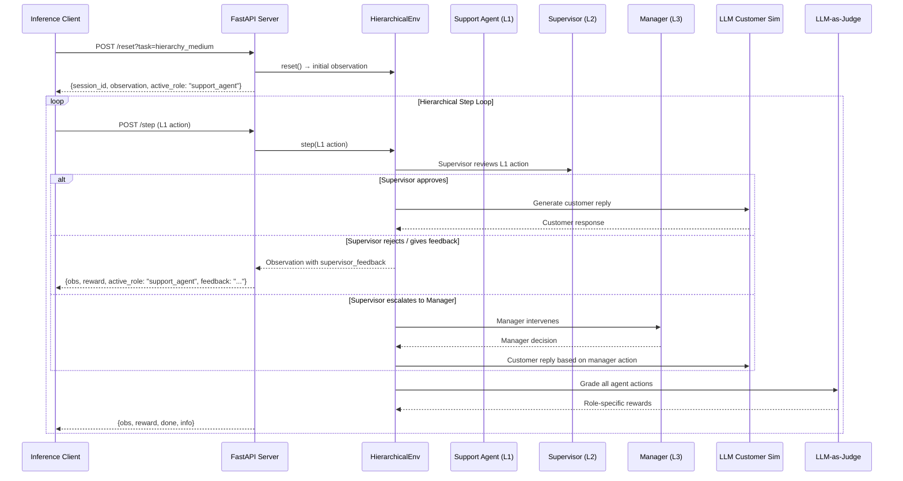

# Round 2: Hierarchical Multi-Agent Customer Support Environment

## Goal

Upgrade the existing single-agent Customer Support RL Environment into a **3-level hierarchical multi-agent system** that showcases:
- **Multi-Agent Interactions** (cooperation, oversight, hierarchy)
- **Professional Tasks** (enterprise workflows with Indian context)
- **Instruction Following** (role-specific instructions per agent)
- **Self-Improvement** (RL training with dense, non-gamable rewards)

The system will have:
1. **Level 1 — Support Agent**: Handles initial customer interaction
2. **Level 2 — Supervisor Agent**: Monitors Support Agent, gives feedback, enforces policy
3. **Level 3 — Manager Agent**: Handles escalations, resolves conflicts, makes final decisions

---

## User Review Required

> [!IMPORTANT]
> **API Provider Decision**: The plan uses your existing NVIDIA NIM keys (via OpenAI-compatible API) for both the customer simulator and LLM-as-Judge. If you want to use a different provider (OpenRouter, Bedrock, Claude), let me know and I'll adjust the API calls.

> [!IMPORTANT]
> **Backward Compatibility**: The Round 1 single-agent `/reset` and `/step` endpoints will be **preserved** alongside the new hierarchical endpoints. Old inference.py tasks (easy/medium/hard/nightmare) still work unchanged. New hierarchical tasks are added separately.

> [!WARNING]
> **LLM Cost During Development**: The customer simulator and LLM-as-Judge both make API calls during `/step`. For training, you'll want to batch these or switch to a local model. During dev/testing, each episode will use ~5-15 API calls for the customer sim and ~3-8 for the judge. With 3 NVIDIA keys on failover, this should be manageable.

---

## Open Questions

> [!IMPORTANT]
> **Q1**: Should the Manager agent be LLM-driven during inference (like Support and Supervisor), or should it be a rule-based oracle that acts as the "gold standard" for training? Rule-based is simpler and more deterministic for RL; LLM-driven is more impressive for the demo.
>
> **My recommendation**: LLM-driven for inference/demo, but with a deterministic fallback for training mode.

> [!IMPORTANT]
> **Q2**: For the Hinglish customer simulator — should this only trigger on frustration, or should some tickets start in Hinglish from the beginning (to test multilingual capability)?
>
> **My recommendation**: Start in English, degrade to Hinglish when `frustration_level > 0.6`. Add 2-3 tickets that start in Hinglish.

---

## Architecture Overview



---

## Proposed Changes

### Component 1: Models (`env/models.py`)

#### [MODIFY] [models.py](file:///home/lebi/projects/meta_hack/env/models.py)

Expand the models to support the multi-agent hierarchy. Key additions:

**New Enums:**
- `AgentRole` — `support_agent`, `supervisor`, `manager`
- `SupervisorDecision` — `approve`, `reject`, `feedback`, `escalate_to_manager`
- `ManagerDecision` — `override`, `approve_escalation`, `resolve_directly`, `send_back`

**Updated `Action` model:**
- Add `role: AgentRole` field (who is taking this action)
- Add `internal_note: Optional[str]` (internal reasoning, not shown to customer)
- Add `supervisor_decision: Optional[SupervisorDecision]`
- Add `manager_decision: Optional[ManagerDecision]`
- Add `feedback_to_agent: Optional[str]` (supervisor/manager feedback)

**Updated `Observation` model:**
- Add `active_role: AgentRole` (which agent should act next)
- Add `supervisor_feedback: Optional[str]` (feedback from supervisor)
- Add `manager_directive: Optional[str]` (directive from manager)
- Add `hierarchy_state: HierarchyState` (nested model with internal comms)
- Add `environment_event: Optional[str]` (schema drift events)
- Add `policy_context: str` (current active policy, changes mid-episode)
- Add `escalation_chain: List[str]` (history of escalations)

**New `HierarchyState` model:**
- `support_agent_actions: int`
- `supervisor_reviews: int`
- `manager_interventions: int`
- `current_phase: str` (e.g., "support_handling", "supervisor_review", "manager_override")
- `escalation_reason: Optional[str]`

**Updated `Reward` model:**
- Add role-specific score fields: `empathy_score`, `oversight_score`, `decision_quality_score`
- Add `role_reward: Dict[str, float]` (per-role breakdown)

---

### Component 2: Environment (`env/environment.py`)

#### [MODIFY] [environment.py](file:///home/lebi/projects/meta_hack/env/environment.py)

Major refactor to support hierarchical step logic:

**New class: `HierarchicalCustomerSupportEnv`** (subclasses or replaces `CustomerSupportEnv`)

**Hierarchical step logic:**
1. **Phase 1 — Support Agent acts**: Client sends L1 action → env logs it
2. **Phase 2 — Supervisor review**: Environment auto-invokes supervisor logic:
   - **If LLM-driven** (inference mode): returns observation asking client for supervisor action
   - **If rule-based** (training mode): auto-evaluates based on policy rules
3. **Phase 3 — Manager intervention** (only if escalated): Same pattern as supervisor

**Key methods:**
- `step_support(action)` — L1 agent acts
- `step_supervisor(action)` — L2 reviews, decides approve/reject/escalate
- `step_manager(action)` — L3 resolves high-priority cases
- `step(action)` — unified entry point, routes based on `action.role`

**Schema/Policy Drift:**
- At random steps (configurable), inject `environment_event` into observation
- Examples: "Refund portal down", "New policy: max refund $50", "System outage: cannot query orders"
- Stored in `self._active_policies` dict, checked by reward engine

**LLM Customer Simulator:**
- Replace `_FOLLOW_UPS` with async LLM call via NVIDIA NIM
- Prompt template includes: persona, frustration level, conversation history, Hinglish trigger
- Frustration increases when tone is bad, decreases when empathetic
- When `frustration > 0.6`: 40% chance of Hinglish response

---

### Component 3: LLM Customer Simulator (NEW)

#### [NEW] [customer_simulator.py](file:///home/lebi/projects/meta_hack/env/customer_simulator.py)

Standalone module for the LLM-driven customer:

```python
class CustomerSimulator:
    """LLM-driven customer that responds dynamically based on agent quality."""

    def __init__(self, api_key: str, base_url: str, model: str):
        ...

    async def generate_reply(
        self,
        persona: str,
        frustration_level: float,
        history: List[Message],
        ticket_context: str,
        use_hinglish: bool = False,
    ) -> str:
        """Generate contextual customer reply using LLM."""
        ...

    def _build_customer_prompt(self, ...) -> str:
        """Build the customer persona prompt with Hinglish instructions."""
        ...
```

**Fallback**: If LLM call fails, fall back to the existing `_FOLLOW_UPS` dict (graceful degradation).

---

### Component 4: Reward Engine (`env/reward_engine.py`)

#### [MODIFY] [reward_engine.py](file:///home/lebi/projects/meta_hack/env/reward_engine.py)

Complete overhaul to hybrid dense reward system:

**Overall Session Reward Components:**
| Component | Weight | Method |
|-----------|--------|--------|
| Resolution Quality | 0.25 | LLM-as-Judge |
| SLA Compliance | 0.15 | Rule-based (steps, timing) |
| Customer Satisfaction | 0.15 | Sentiment trajectory + LLM judge |
| Policy Adherence | 0.15 | LLM-as-Judge |
| Information Accuracy | 0.10 | Rule-based (regex patterns) |
| Efficiency | 0.10 | Rule-based (steps/max_steps) |
| Hierarchy Effectiveness | 0.10 | Rule-based (correct escalations, feedback quality) |

**Role-Specific Rewards:**

| Role | Metric | Weight | Method |
|------|--------|--------|--------|
| **Support Agent** | Empathy & Tone | 0.30 | LLM-as-Judge |
| | Information Gathering | 0.25 | Rule-based |
| | Response Accuracy | 0.25 | LLM-as-Judge |
| | Efficiency | 0.20 | Rule-based |
| **Supervisor** | Oversight Quality | 0.35 | LLM-as-Judge (was the review correct?) |
| | Escalation Accuracy | 0.30 | Rule-based (should it have escalated?) |
| | Feedback Usefulness | 0.20 | LLM-as-Judge |
| | Speed of Review | 0.15 | Rule-based |
| **Manager** | Decision Quality | 0.40 | LLM-as-Judge |
| | Conflict Resolution | 0.30 | LLM-as-Judge |
| | Final Outcome | 0.30 | Rule-based (was it resolved?) |

**Penalties (Non-Gamable):**
| Penalty | Value | Trigger |
|---------|-------|---------|
| Repetition | -0.15 | TF-IDF cosine > 0.80 |
| Policy Violation | -0.25 | LLM detects violation of active policy |
| Unnecessary Escalation | -0.20 | L1 escalates low-priority ticket |
| Unnecessary Manager Call | -0.20 | L2 escalates when it shouldn't |
| Ignored Supervisor Feedback | -0.15 | L1 repeats same mistake after feedback |
| Keyword Stuffing | -0.30 | High keyword density without substance |
| Contradiction | -0.15 | Claims done then asks for info |

#### [NEW] [llm_judge.py](file:///home/lebi/projects/meta_hack/env/llm_judge.py)

```python
class LLMJudge:
    """Async LLM-as-Judge for semantic reward evaluation."""

    RUBRIC_EMPATHY = """..."""
    RUBRIC_POLICY = """..."""
    RUBRIC_RESOLUTION = """..."""

    async def evaluate_empathy(self, message: str, context: str) -> float: ...
    async def evaluate_policy_adherence(self, action: Action, policy: str) -> float: ...
    async def evaluate_resolution(self, history: List[Message], ticket: dict) -> float: ...
    async def evaluate_supervisor_oversight(self, review: str, l1_action: Action) -> float: ...
    async def evaluate_manager_decision(self, decision: str, context: str) -> float: ...
```

**Anti-Gaming Measures:**
- LLM judge uses a strict rubric with negative examples
- Keyword density check: if resolution keywords > 5% of message, flag as stuffing
- Tone must be contextually appropriate (not just positive sentiment)
- Resolution must reference specific ticket details (not generic)

---

### Component 5: Schema/Policy Drift (NEW)

#### [NEW] [policy_engine.py](file:///home/lebi/projects/meta_hack/env/policy_engine.py)

```python
class PolicyEngine:
    """Manages dynamic policy changes and schema drift during episodes."""

    DRIFT_EVENTS = [
        {"trigger_step": 3, "event": "Refund portal is currently down. Do not promise immediate refunds.",
         "policy_change": {"can_refund": False}},
        {"trigger_step": 4, "event": "New policy: Maximum refund amount is now $50.",
         "policy_change": {"max_refund": 50}},
        {"trigger_step": 2, "event": "System outage: Order lookup service unavailable.",
         "policy_change": {"can_query_orders": False}},
    ]

    def check_drift(self, step: int, task: str) -> Optional[dict]: ...
    def get_active_policy(self) -> str: ...
```

---

### Component 6: Graders

#### [NEW] [task_hierarchy_easy.py](file:///home/lebi/projects/meta_hack/env/graders/task_hierarchy_easy.py)
#### [NEW] [task_hierarchy_medium.py](file:///home/lebi/projects/meta_hack/env/graders/task_hierarchy_medium.py)
#### [NEW] [task_hierarchy_hard.py](file:///home/lebi/projects/meta_hack/env/graders/task_hierarchy_hard.py)

Each grader evaluates the full hierarchy:
- Was the Support Agent's initial response appropriate?
- Did the Supervisor make the right review decision?
- Was Manager intervention necessary and effective?
- Overall session quality

---

### Component 7: OpenEnv Config

#### [MODIFY] [openenv.yaml](file:///home/lebi/projects/meta_hack/openenv.yaml)

Add new hierarchical tasks while keeping existing tasks:

```yaml
tasks:
  # ... existing easy/medium/hard/nightmare ...
  - name: hierarchy_easy
    description: >
      Hierarchical multi-agent: Support Agent handles billing FAQ.
      Supervisor reviews and approves. No manager needed.
    max_steps: 8
  - name: hierarchy_medium
    description: >
      Hierarchical multi-agent: Support Agent handles technical issue.
      Supervisor may give feedback or request corrections.
      Mid-episode policy drift possible.
    max_steps: 12
  - name: hierarchy_hard
    description: >
      Hierarchical multi-agent: Critical SLA breach requiring all 3 levels.
      Support Agent must recognize urgency, Supervisor must escalate,
      Manager must make final decision. Schema drift guaranteed.
    max_steps: 15

action_space:
  type: ActionType
  values:
    - respond
    - escalate
    - close
    - request_info
    - supervisor_approve
    - supervisor_reject
    - supervisor_feedback
    - supervisor_escalate
    - manager_override
    - manager_resolve
    - manager_send_back

observation_space:
  # ... existing fields ...
  active_role: "support_agent | supervisor | manager"
  supervisor_feedback: "string | null"
  manager_directive: "string | null"
  environment_event: "string | null"
  policy_context: string
  escalation_chain: "list[string]"
  hierarchy_state:
    support_agent_actions: int
    supervisor_reviews: int
    manager_interventions: int
    current_phase: string
```

---

### Component 8: Server

#### [MODIFY] [app.py](file:///home/lebi/projects/meta_hack/server/app.py)

- Import and register `HierarchicalCustomerSupportEnv`
- The existing `/reset` and `/step` endpoints continue to work for single-agent tasks
- For `hierarchy_*` tasks, `/reset` creates a `HierarchicalCustomerSupportEnv`
- `/step` auto-detects env type and routes accordingly
- No new endpoints needed — the hierarchy is managed inside the environment

---

### Component 9: Inference

#### [MODIFY] [inference.py](file:///home/lebi/projects/meta_hack/inference.py)

Add hierarchical inference mode:
- New `HIERARCHY_TASKS` list
- Role-specific system prompts:
  - `SUPPORT_AGENT_PROMPT`: Focus on empathy, info gathering, resolution
  - `SUPERVISOR_PROMPT`: Focus on reviewing L1 quality, policy compliance
  - `MANAGER_PROMPT`: Focus on high-stakes decisions, conflict resolution
- `run_hierarchy_task()`: Multi-turn loop that switches prompts based on `active_role`
- Existing `run_task()` unchanged for backward compatibility

---

### Component 10: Ticket Store Updates

#### [MODIFY] [ticket_store.py](file:///home/lebi/projects/meta_hack/env/ticket_store.py)

Add hierarchy-specific tickets with Indian enterprise context:
- UPI payment failures
- Big Billion Days SLA breaches
- KYC document rejection loops
- Cross-border payment compliance issues

---

## File Change Summary

| File | Action | Description |
|------|--------|-------------|
| `env/models.py` | MODIFY | Add AgentRole, hierarchy models, expand Action/Observation |
| `env/environment.py` | MODIFY | Add `HierarchicalCustomerSupportEnv`, keep original env |
| `env/customer_simulator.py` | NEW | LLM-driven customer with Hinglish support |
| `env/llm_judge.py` | NEW | LLM-as-Judge for semantic reward evaluation |
| `env/policy_engine.py` | NEW | Schema/policy drift management |
| `env/reward_engine.py` | MODIFY | Hybrid reward with role-specific scores + anti-gaming |
| `env/ticket_store.py` | MODIFY | Add hierarchy tickets with Indian context |
| `env/graders/__init__.py` | MODIFY | Register new hierarchy graders |
| `env/graders/task_hierarchy_easy.py` | NEW | Hierarchy easy grader |
| `env/graders/task_hierarchy_medium.py` | NEW | Hierarchy medium grader |
| `env/graders/task_hierarchy_hard.py` | NEW | Hierarchy hard grader |
| `env/__init__.py` | MODIFY | Export new classes |
| `server/app.py` | MODIFY | Support both env types in /reset and /step |
| `inference.py` | MODIFY | Add hierarchical inference with role-specific prompts |
| `openenv.yaml` | MODIFY | Add hierarchy tasks and expanded action/obs space |
| `requirements.txt` | MODIFY | Add `aiohttp` for async LLM calls |
| `pyproject.toml` | MODIFY | Add `aiohttp` dependency |

---

## Verification Plan

### Automated Tests

```bash
# 1. Start the server
python -m server.app &

# 2. Run existing tests (backward compat)
pytest tests/ -v

# 3. Test hierarchy reset
curl -X POST http://localhost:7860/reset?task=hierarchy_easy

# 4. Test hierarchy step with L1 action
curl -X POST "http://localhost:7860/step?session_id=..." \
  -H "Content-Type: application/json" \
  -d '{"action_type": "respond", "message": "Hello, how can I help?", "role": "support_agent"}'

# 5. Run full hierarchy inference
python inference.py  # runs all tasks including hierarchy
```

### Manual Verification
- Run a complete hierarchy_medium episode and verify all 3 agent levels are engaged
- Verify policy drift triggers mid-episode
- Verify Hinglish customer replies when frustration is high
- Verify LLM-as-Judge produces non-gamable scores
- Verify backward compatibility: old easy/medium/hard tasks still work identically

---

## Next Steps for Unsloth Training

After this upgrade is working:

1. **Create `train_grpo.py`**: Wrap the HTTP API in a Gym-like interface for TRL
2. **Generate trajectories**: Run N episodes with base model, collect (state, action, reward) tuples
3. **Train with GRPO**: Use Unsloth + TRL `GRPOTrainer` on `unsloth/Meta-Llama-3-8B-Instruct`
4. **Focus training**: Train L1 (Support Agent) first, then L2 (Supervisor)
5. **Generate plots**: baseline vs. trained reward curves with matplotlib
